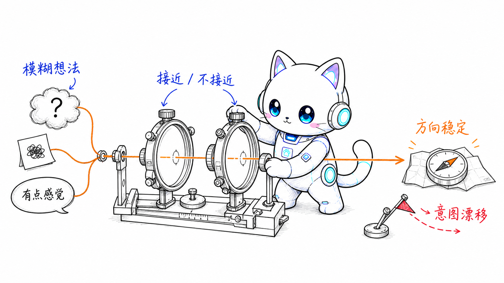
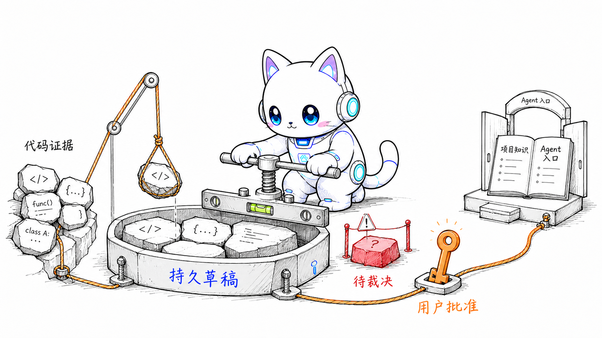
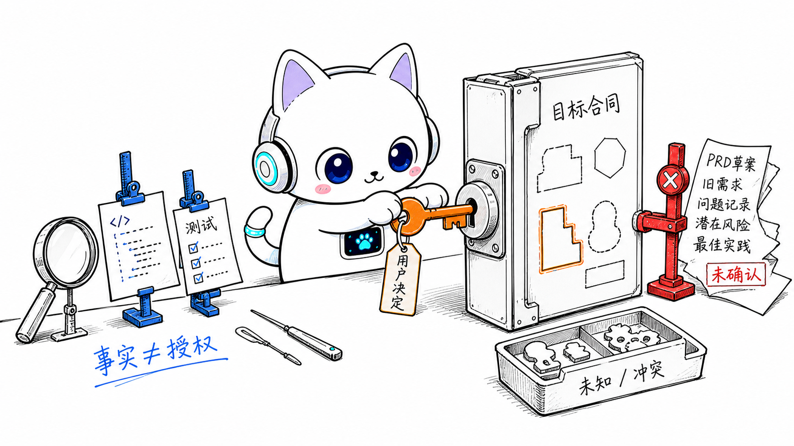
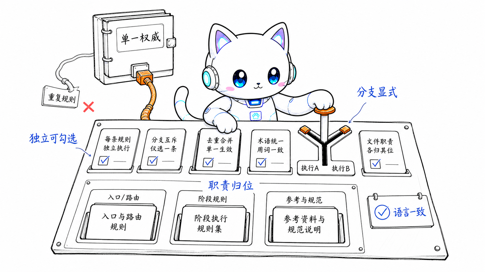
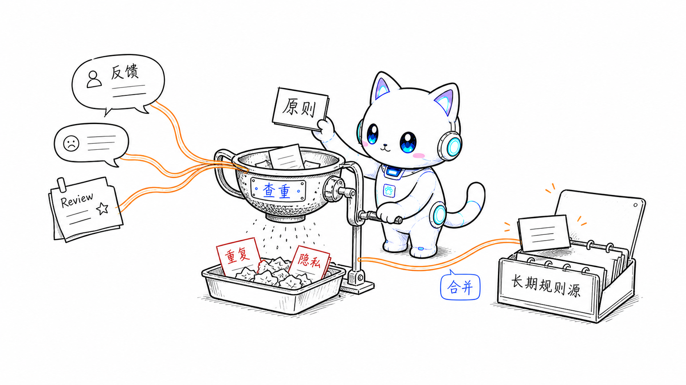

<p align="center">
  
</p>

<h1 align="center">Codeartz Skills</h1>

<p align="center">
  <em>先收边界，再过证据，最后让项目持续进化。</em>
</p>

<p align="center">
  <strong>意图导航 &middot; 项目奠基 &middot; 边界分析 &middot; 指令审查 &middot; Agent Evolve</strong><br>
  <sub>一组给 agent 用的工程流程 skills。</sub>
</p>

---

## How it works

<p align="center">
  
  <br>
  <sub>1. agentic-design-navigator：从模糊想法出发，反复校准理解，稳定设计方向并检查意图漂移。</sub>
</p>

<p align="center">
  
  <br>
  <sub>2. project-foundation：把散落在代码里的架构、领域与开发约定沉淀为可追溯、可刷新的项目全貌，让未来 agent 不再猜项目。</sub>
</p>

<p align="center">
  
  <br>
  <sub>3. target-boundary：混合资料先过边界秤，沉淀成有证据链的目标合同。</sub>
</p>

<p align="center">
  
  <br>
  <sub>4. instruction-doc-audit：深缩进、复合句和重复规则被压平成可勾选条目。</sub>
</p>

<p align="center">
  
  <br>
  <sub>5. Agent Evolve：主 agent 识别可复用用户反馈，查重、过滤隐私，再用原因与证据安全合并。</sub>
</p>

## What it is

这不是一个“让 agent 更努力”的 prompt 包。它是一组把复杂输入收敛为工程产物，并让项目规则持续吸收用户反馈的 skills：

| Skill                                                          | 用在什么时候                                                                                            | 结果                                                                                                     |
| -------------------------------------------------------------- | ------------------------------------------------------------------------------------------------------- | -------------------------------------------------------------------------------------------------------- |
| [`agentic-design-navigator`](skills/agentic-design-navigator/) | 用户只给出模糊想法、感觉、问题或关键词，或设计讨论发生明显变化，需要稳定意图并检查偏离                  | 逐阶段稳定意图、建立设计理解、生成方案，并在讨论变化时显式指出意图漂移                                   |
| [`target-boundary`](skills/target-boundary/)                   | requirements、PRD、spec、issues、review notes、会话记录和仓库证据混在一起，需要分析边界、根因或技术方案 | 写入 `.codeartz/<topic>/target-boundary.md`；满足确认停靠点后生成 `.codeartz/<topic>/context-handoff.md` |
| [`instruction-doc-audit`](skills/instruction-doc-audit/)       | 指令、规范、规则手册、政策、提示词或技能文档存在职责混杂、分支隐式或层级过深                            | 给出命中项和改写建议，或按编辑模式改成可执行、语言一致的规则                                             |
| [`project-foundation`](skills/project-foundation/)             | 现有仓库缺少 Agent 读取入口、架构、领域、开发约定等项目知识，或正式知识需要跟随代码演进进行刷新         | 从仓库证据建立当前草稿；逐项裁决并批准后，建立或刷新正式项目知识与读取路由                               |
| [`agent-evolve`](skills/agent-evolve/)                         | 主会话中的用户反馈会改变未来代码模式、架构、规范、边界或实践决策                                        | 按当前模式更新或提案到未来 agent 会读取的项目已有规则源；每条候选都输出原因与证据                        |

## When to use

使用 `agentic-design-navigator`：

- 用户只给出一句模糊想法、一个感觉、一个问题或几个关键词。
- 设计讨论存在多个可能理解，需要先帮助用户发现和稳定意图。
- 设计讨论出现明显变化，需要检查主体、情境、目的或成功标准是否发生漂移。
- 需要在意图稳定后使用设计框架建立理解并生成方案。

使用 `target-boundary`：

- 用户输入同时包含需求资料和既有系统行为。
- 需要先证明当前系统事实，再决定方案边界。
- 需要把适用分区、不适用分区、保持原行为、未知和冲突写清楚。
- 需要把方案沉淀成后续实现 agent 可以接手的上下文文件。

使用 `instruction-doc-audit`：

- 文档读起来像“介绍自己”，但没有告诉 agent 怎么行动。
- 一句话里塞了条件、动作、禁止和例外。
- 中文正文混入可本地化英文，或英文正文混入可英文替换的中文说明词。
- `SKILL.md`、阶段手册、参考文件之间职责混杂或重复维护同一条规则。

使用 `project-foundation`：

- 项目已有代码，但没有可靠的 `AGENTS.md`、`CLAUDE.md` 或项目知识文档。
- 需要区分代码事实、稳定模式、设计推断、冲突、知识缺口与技术债。
- 需要根据知识主题、适用范围和读取情境设计最小项目知识结构。
- 需要用可跨会话跟踪的当前草稿记录证据、完整内容、待裁决项、批准与合并结果。
- 已有正式项目知识需要对账当前代码，并发现代码演进产生的新知识。

使用 `agent-evolve`：

- 用户在主会话中纠正代码 pattern、架构、规范、边界或好实践。
- 反馈会改变后续项目任务中的 agent 决策。
- 需要把规则合并到未来 agent 已有读取路径，并证明唯一权威落点、无重复、无冲突。
- 需要为沉淀或不沉淀展示反馈结论、原因与证据。

## Agent Evolve 模式

默认模式是 `safe`。新会话在 `SessionStart` 固化当前模式并只注入短路由；命中直接用户反馈后才加载 Agent Evolve，并按工作流、安全验证阶段依次读取对应手册。`UserPromptSubmit` 只处理下列完整控制命令，不分类普通消息。

| 模式     | 自动识别 | 默认处理                                   | 用户后续动作                     | 启动路由 |
| -------- | -------- | ------------------------------------------ | -------------------------------- | -------- |
| `safe`   | 是       | 安全门全部通过时自动写入；否则输出“已提案” | 按“推荐操作”解除具体阻塞条件     | 短路由   |
| `review` | 是       | 只输出“已提案”                             | 批准精确的“目标位置”与“建议变更” | 短路由   |
| `off`    | 否       | 不自动处理                                 | 手动调用 Skill                   | 无       |

`safe` 不需要预先批准。“已提案”表示至少一个写入条件尚未满足；回执中的“推荐操作”会说明下一步是批准精确提案、指定权威落点、补足读取路径，还是裁决规则冲突。普通批准不能替代尚未满足的其他安全门。

项目已有规范文档但未来 agent 尚无读取路径时，Agent Evolve 只提案最小读取入口；新建入口或增加路由需要用户批准。

当前会话：

```text
$agent-evolve safe
$agent-evolve review
$agent-evolve off
```

后续新会话的持久默认值：

```text
$agent-evolve default safe
$agent-evolve default review
$agent-evolve default off
```

宿主提供的 `/agent-evolve` 或 `@agent-evolve` 前缀也可以调用同一组命令。`default` 命令不改变当前会话。

## Install

### Claude Code

```text
/plugin marketplace add hanjeahwan/codeartz-skills
/plugin install codeartz-skills@codeartz
```

Claude Code 安装后打开 `/hooks`，审查并信任 Codeartz 的 `SessionStart` 与 `UserPromptSubmit` hook；然后重启应用或开启新会话。

### Codex

```bash
codex plugin marketplace add hanjeahwan/codeartz-skills
codex plugin add codeartz-skills@codeartz
```

Codex 安装后打开 `/hooks`，审查并信任 Codeartz 的 `SessionStart` 与 `UserPromptSubmit` hook；然后重启应用或开启新会话。

### Standalone skills

只想安装单个 skill，可使用 `npx skills add`：

```bash
npx skills add https://github.com/hanjeahwan/codeartz-skills --skill agentic-design-navigator
npx skills add https://github.com/hanjeahwan/codeartz-skills --skill target-boundary
npx skills add https://github.com/hanjeahwan/codeartz-skills --skill instruction-doc-audit
npx skills add https://github.com/hanjeahwan/codeartz-skills --skill project-foundation
npx skills add https://github.com/hanjeahwan/codeartz-skills --skill agent-evolve
```

Standalone 安装不包含 lifecycle hook；`agent-evolve` 仍可由用户手动调用。

## Commands

| 入口                       | 作用                                                                |
| -------------------------- | ------------------------------------------------------------------- |
| `agentic-design-navigator` | 从模糊输入中稳定用户意图，建立设计理解、生成方案并检查意图漂移      |
| `target-boundary`          | 把混合资料、代码证据和风险收敛成目标边界、技术方案和上下文交接文件  |
| `instruction-doc-audit`    | 审查祈使型文档，找出不可执行、语言不一致和结构职责混杂的问题        |
| `project-foundation`       | 从现有代码建立或刷新可裁决、可批准、可追溯的项目知识基础            |
| `agent-evolve`             | 语义判断用户直接反馈，并按 safe/review/off 合并、提案或停止自动沉淀 |
