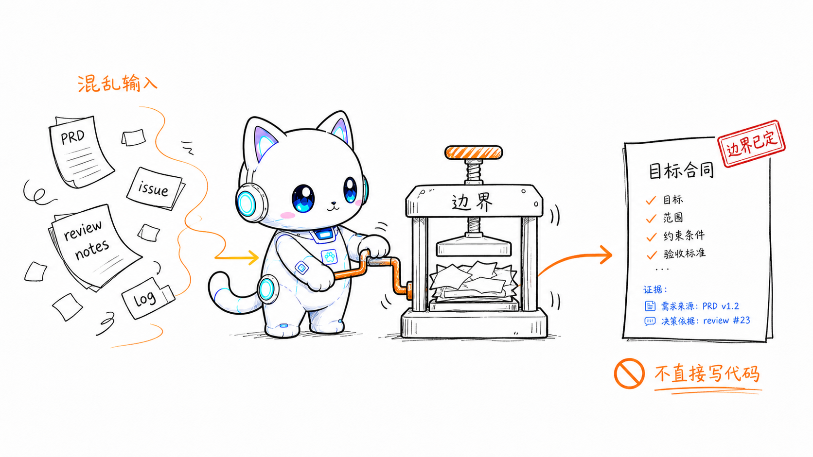
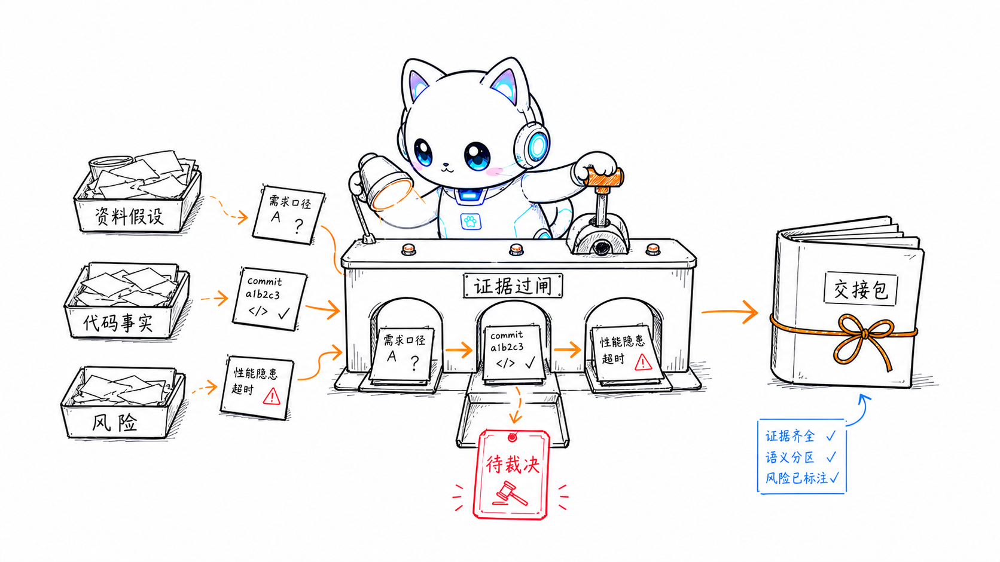
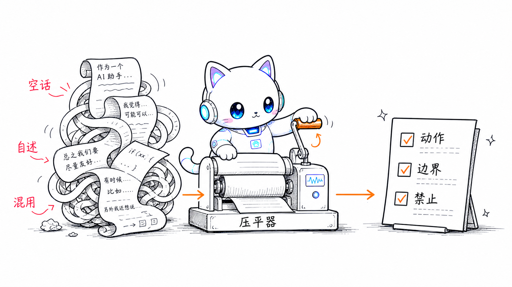

<p align="center">
  
</p>

<h1 align="center">Codeartz Skills</h1>

<p align="center">
  <em>先收边界，再过证据，最后交接给实现。</em>
</p>

<p align="center">
  <strong>边界分析 &middot; 证据关卡 &middot; 指令审查 &middot; 上下文交接</strong><br>
  <sub>一组给 agent 用的工程流程 skills。</sub>
</p>

---

## How it works

<p align="center">
  
  <br>
  <sub>1. 先收边界：PRD、issue、评审意见和仓库线索先压成目标合同。</sub>
</p>

<p align="center">
  
  <br>
  <sub>2. 过证据闸：资料假设、代码事实、风险和待裁决点逐项检查。</sub>
</p>

<p align="center">
  
  <br>
  <sub>3. 审指令手册：自述、空话和语言混杂改成可执行规则。</sub>
</p>

## What it is

这不是一个“让 agent 更努力”的 prompt 包。它是一组把复杂输入收敛为工程产物的 skills：

| Skill                                                    | 用在什么时候                                                                                            | 结果                                                                                                     |
| -------------------------------------------------------- | ------------------------------------------------------------------------------------------------------- | -------------------------------------------------------------------------------------------------------- |
| [`target-boundary`](skills/target-boundary/)             | requirements、PRD、spec、issues、review notes、会话记录和仓库证据混在一起，需要分析边界、根因或技术方案 | 写入 `.codeartz/<topic>/target-boundary.md`；满足确认停靠点后生成 `.codeartz/<topic>/context-handoff.md` |
| [`instruction-doc-audit`](skills/instruction-doc-audit/) | 指令、规范、规则手册、政策、提示词或技能文档有自述、空话、语言混杂、职责混杂、分支隐式或层级过深        | 给出命中项和改写建议，或按编辑模式直接改成可执行、语言一致的规则                                         |
| [`agent-feedback-loop`](skills/agent-feedback-loop/)     | 用户给出行为纠正、失败复盘、review 结论或“以后 / 下次 / 记住 / 写进规则”这类反馈时                      | 抽象成可复用规则，优先合并到已知长期规则源；无法安全写入时输出提案或不沉淀原因                           |

## When to use

使用 `target-boundary`：

- 用户输入同时包含需求资料和既有系统行为。
- 需要先证明当前系统事实，再决定方案边界。
- 需要把适用分区、不适用分区、保持原行为、未知和冲突写清楚。
- 需要把方案沉淀成后续实现 agent 可以接手的上下文文件。

使用 `instruction-doc-audit`：

- 文档读起来像“介绍自己”，但没有告诉 agent 怎么行动。
- 一句话里塞了条件、动作、禁止和例外。
- 中文正文混入可本地化英文，或英文正文混入可英文替换的中文说明词。
- `SKILL.md`、阶段手册、参考文件之间职责混杂或重复维护同一条规则。

使用 `agent-feedback-loop`：

- 用户要求把反馈写进长期规则源。
- 用户指出 agent 的重复错误或行为漂移。
- 用户说“以后”“下次”“记住”“不要再”“写进规则”“更新手册”。
- 需要先查重、查冲突，再把规则合并进已有 docs、手册、规范或 agent 指令。

## Install

### Claude Code

```text
/plugin marketplace add hanjeahwan/codeartz-skills
/plugin install codeartz-skills@codeartz
```

Claude Code 安装后打开 `/hooks`，review 并 trust Codeartz 的 lifecycle hooks；然后重启应用或开启新线程。

### Codex

```bash
codex plugin marketplace add hanjeahwan/codeartz-skills
codex plugin add codeartz-skills@codeartz
```

Codex 安装后打开 `/hooks`，review 并 trust Codeartz 的 lifecycle hooks；然后重启应用或开启新线程。

### Standalone skills

只想装单个 skill，用 `npx skills add`：

```bash
npx skills add https://github.com/hanjeahwan/codeartz-skills --skill target-boundary
npx skills add https://github.com/hanjeahwan/codeartz-skills --skill instruction-doc-audit
```

## Commands

| 入口                    | 作用                                                                     |
| ----------------------- | ------------------------------------------------------------------------ |
| `target-boundary`       | 把混合资料、代码证据和风险收敛成目标边界、技术方案和上下文交接文件       |
| `instruction-doc-audit` | 审查祈使型文档，找出不可执行、语言不一致和结构职责混杂的问题             |
| `agent-feedback-loop`   | 把用户 feedback 抽象成长期规则，查重、查冲突后合并到已有规则源或输出提案 |
